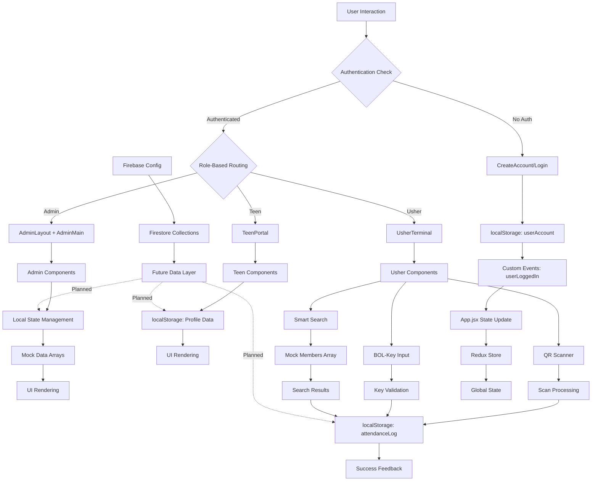
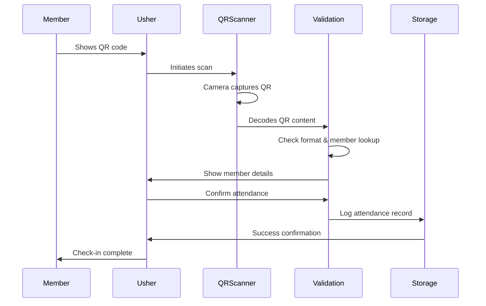
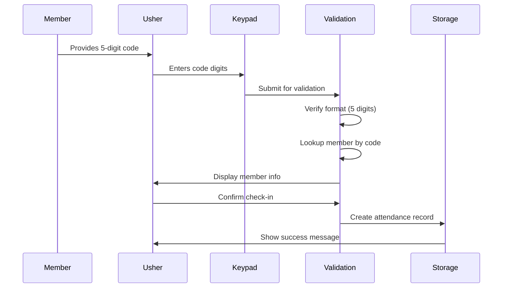
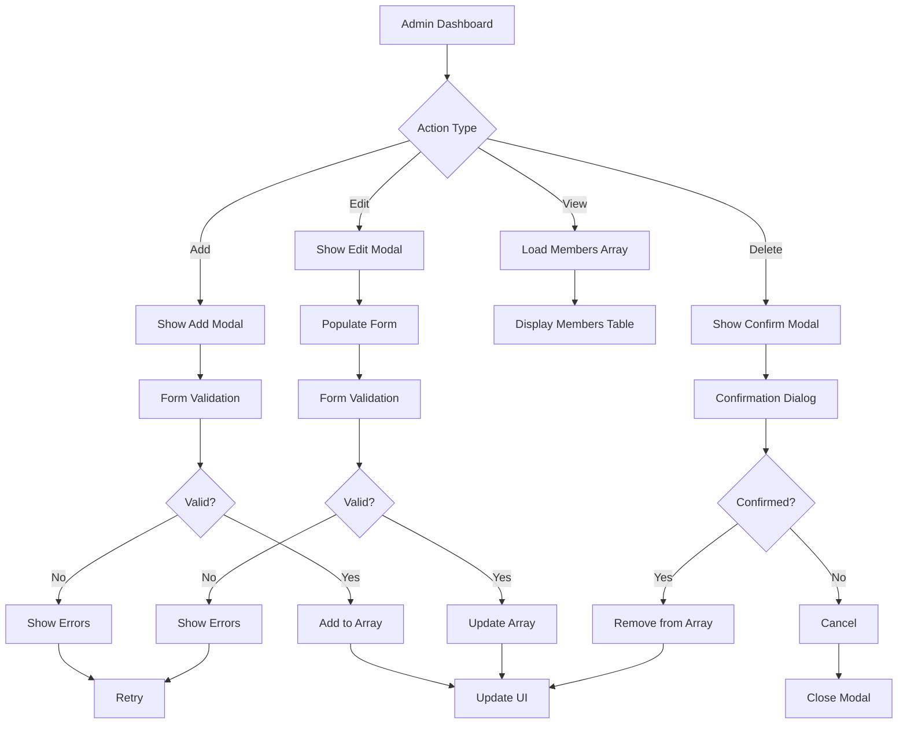

# BOL-TAS Data Flow Architecture

## System Data Flow Overview

## Detailed Data Flow Diagrams

### QR Code Attendance Flow

### BOL-Key Check-in Flow

### Admin Member Management Flow

## Key Data Flow Patterns

### **Authentication Flow**
1. **User Input** → Form validation → localStorage check
2. **Success** → Custom event dispatch → App state update → Route navigation
3. **Persistence** → localStorage maintains session across browser refreshes

### **Admin Data Flow**
1. **Component Mount** → Initialize local state with mock data arrays
2. **User Actions** → State updates (add/edit/delete members)
3. **Data Storage** → Currently in-memory only (no persistence)
4. **UI Updates** → React re-renders based on state changes

### **Usher Terminal Data Flow**
1. **QR Scanning** → Camera access → QR code detection → Result processing
2. **BOL-Key Entry** → Keypad input → Format validation → Check-in processing
3. **Smart Search** → Text input → Mock data filtering → Selection → Check-in
4. **Attendance Logging** → All check-in methods → localStorage persistence
5. **Undo Functionality** → Timestamp-based reversal → State cleanup

### **Teen Portal Data Flow**
1. **Profile Management** → Form inputs → localStorage updates
2. **Security Settings** → Recovery method configuration → localStorage
3. **ID Management** → Static display (currently no dynamic data)

### **State Management Layers**

#### **Local Component State**
- Form inputs, modal visibility, search filters
- Immediate UI feedback and validation

#### **Local Storage Persistence**
- User authentication sessions
- Attendance logs (usher terminal)
- Profile data (teen portal)

#### **Redux Store** (Configured but not actively used)
- Global state management infrastructure ready for expansion

#### **Firebase Integration** (Planned/Infrastructure Only)
- Firestore collections defined but not connected
- Authentication service configured but bypassed
- Real-time data synchronization not implemented

## Current Implementation Status

### **Fully Implemented**
- Role-based routing and UI
- QR code scanning and processing
- BOL-key entry system
- Smart search functionality
- Local storage persistence for sessions and logs

### **Partially Implemented**
- Redux store (configured but not used)
- Firebase services (configured but not connected)

### **Mock Data Dependencies**
- Member management uses hardcoded arrays
- Search functionality uses mock member data
- No real database integration yet

### **Data Synchronization**
- Cross-tab communication via custom events
- localStorage change listeners for multi-tab support
- No server-side synchronization currently

This architecture shows a system in active development with a solid frontend foundation and Firebase infrastructure ready for full backend integration.