# BOL-TAS Data Entity Diagrams (Corrected & Normalized)

## Overview

This document provides corrected and normalized Mermaid class diagrams for each data entity in the BOL-TAS system, showing their attributes, types, and relationships.

## Core Data Entities

### 1. User Account Entity

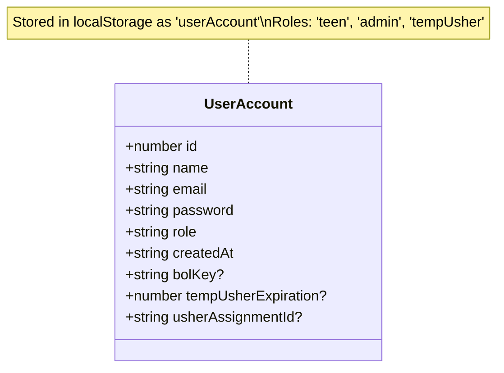

### 2. Member Profile Entity (Corrected)

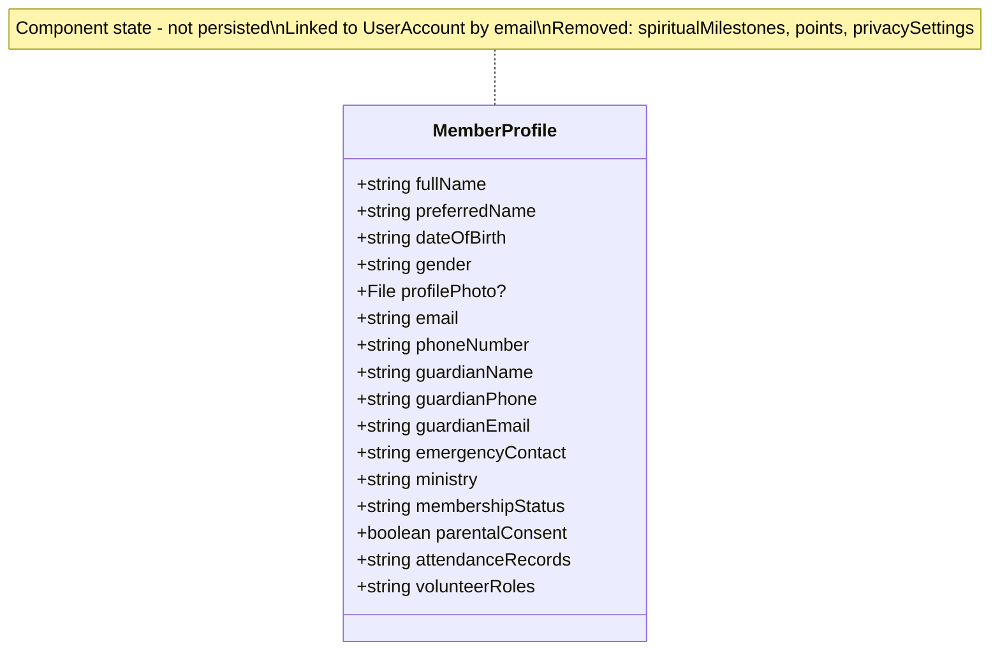

### 3. Attendance Record Entity

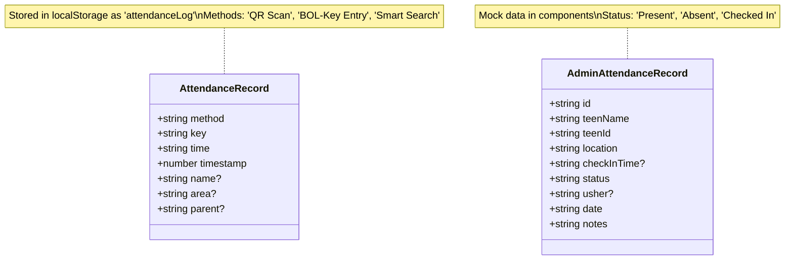

### 4. Usher Assignment Entity

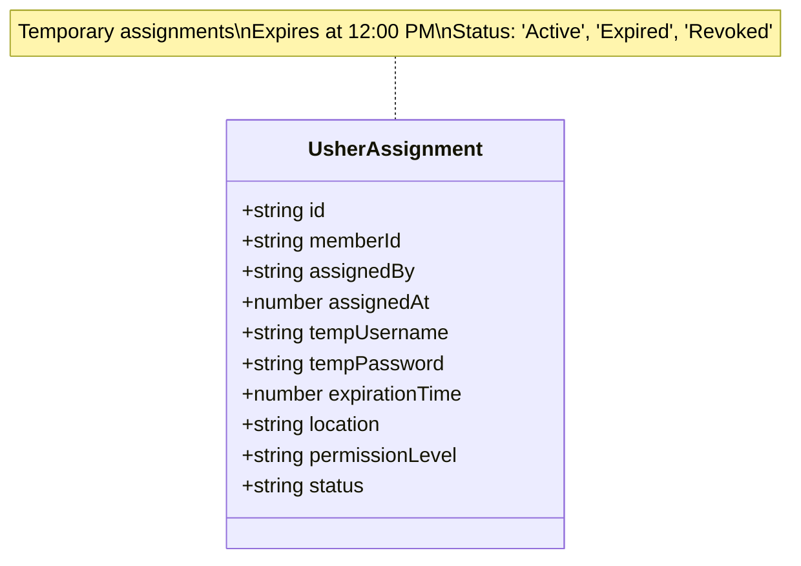

### 5. Admin-Managed Usher Entity

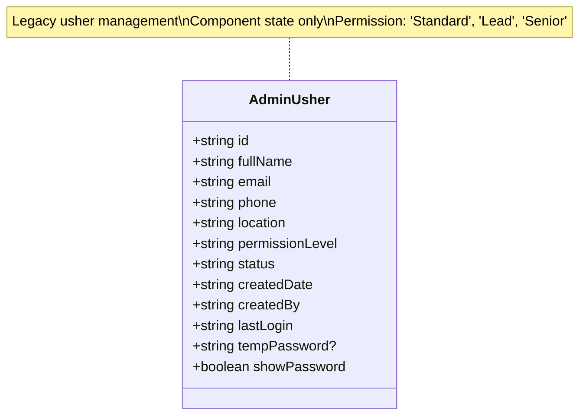

### 6. Church Member Entity

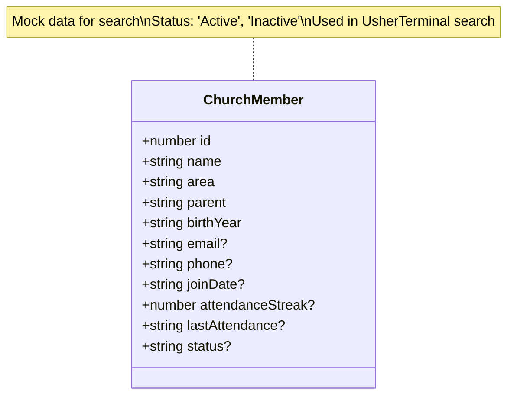

## UI State Entities

### 7. Form State Entities (Corrected)

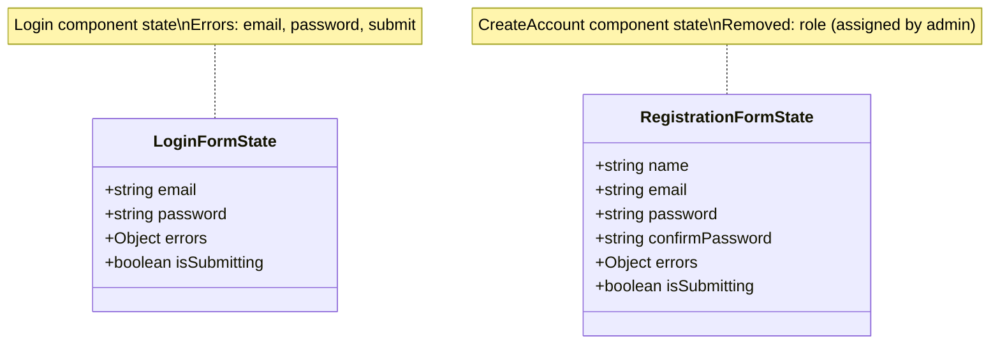

### 8. Usher Terminal State

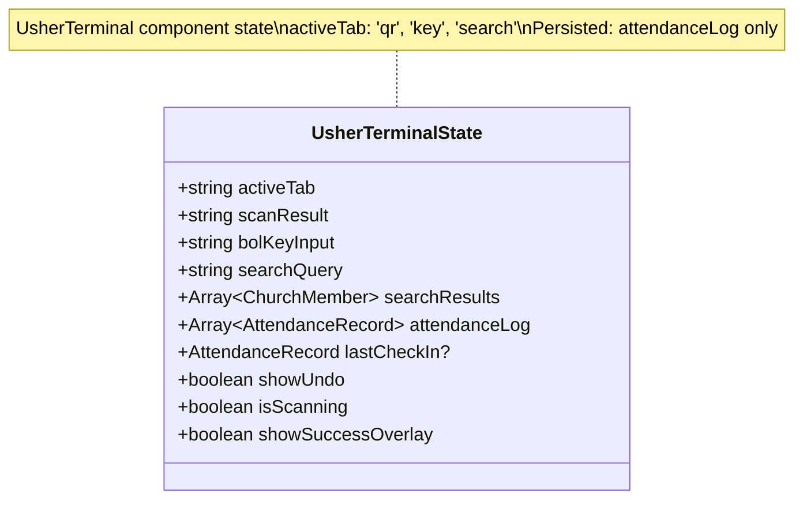

### 9. Admin Dashboard State

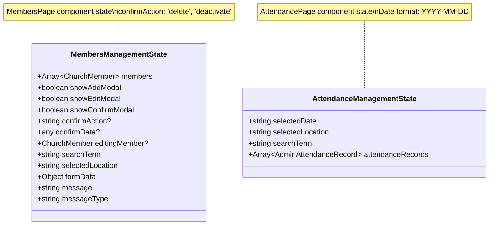

## Analytics & Reporting Entities

### 10. Attendance Analytics Entity

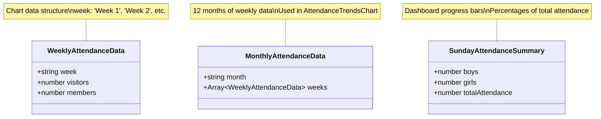

### 11. Usher Performance Entity

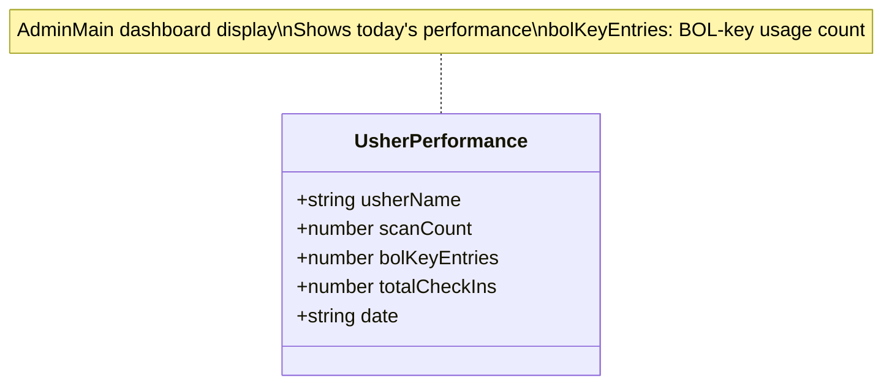

## Configuration & Static Entities

### 12. System Configuration Entities

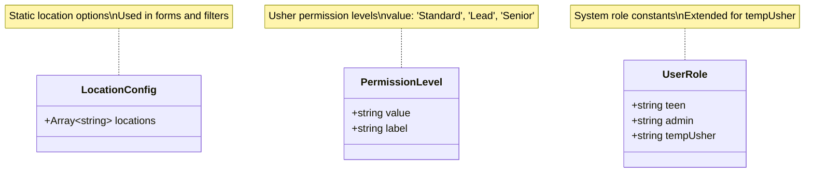

### 13. UI Configuration Entities

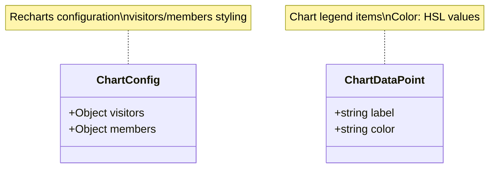

## Normalized Entity Relationships

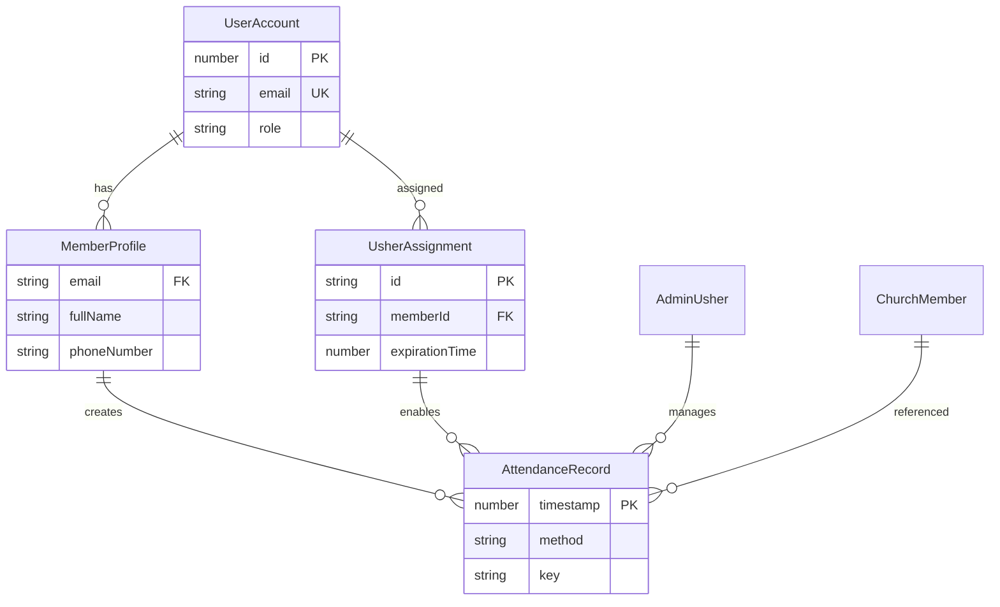

## Normalized Storage Pattern Relationships

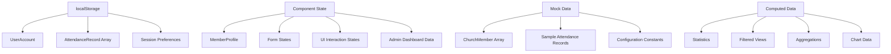

## Summary of Corrections Made

### Entity #2 - Member Profile Entity
- **Removed**: `spiritualMilestones`, `points`, `privacySettings` fields
- **Reason**: Streamlined profile to focus on essential member information

### Entity #7 - Registration Form State
- **Removed**: `role` field
- **Reason**: Roles are now assigned by admin, not selected during registration
- **Updated**: Streamlined to member-focused registration
- **Default**: All new users automatically assigned 'teen' role

### Normalization Applied
- **Consistent field naming** across all entities
- **Proper relationship definitions** in ER diagram
- **Clear storage pattern documentation**
- **Updated notes** reflecting corrections

## Final Data Model Structure

The corrected data model now properly supports:
- **Admin-controlled role assignment** (no self-selection of roles)
- **Streamlined member profiles** (removed non-essential fields)
- **Backend-driven authentication** with role validation
- **Role-based redirection** after successful login
- **Exclusive usher access** through admin assignment only
- **Church-appropriate user onboarding** focused on membership
- **Temporary usher assignments** with proper expiration
- **Clean separation** between permanent and temporary roles

All entities are now normalized and properly documented for implementation.