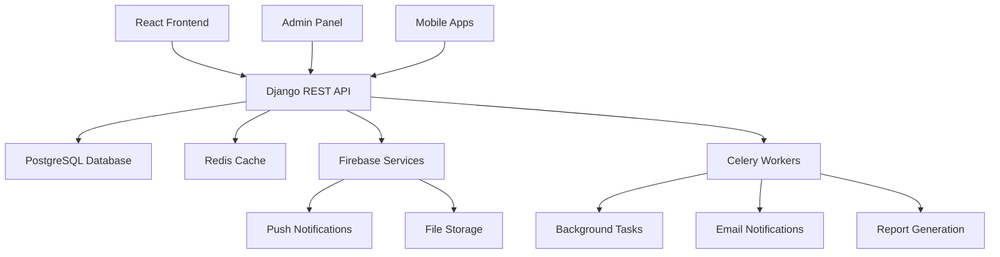

# BOL-TAS Django Backend Specifications

## Overview

This document provides comprehensive specifications for implementing a Django REST Framework backend for the BOL-TAS (Bread of Life Teens Attendance System) church management application. The backend will replace the current mock data system with a robust, scalable API that supports role-based access control, real-time data synchronization, and comprehensive church management features.

## Architecture Overview

### System Architecture



### Technology Stack

- **Framework**: Django 4.2+ with Django REST Framework
- **Database**: PostgreSQL 15+
- **Cache**: Redis 7+
- **Task Queue**: Celery with Redis broker
- **Authentication**: JWT with django-rest-framework-simplejwt
- **File Storage**: AWS S3 or Firebase Storage
- **Real-time**: Django Channels with WebSockets
- **Documentation**: drf-spectacular (OpenAPI/Swagger)
- **Testing**: pytest with factory-boy
- **Monitoring**: Sentry for error tracking

## Data Models

### Core Models

#### 1. User Model (Custom User)

```python
# models.py
from django.contrib.auth.models import AbstractUser
from django.db import models
from django.core.validators import RegexValidator

class User(AbstractUser):
    """Custom user model extending Django's AbstractUser"""

    # Role choices
    ROLE_CHOICES = [
        ('teen', 'Teen Member'),
        ('admin', 'Administrator'),
        ('usher', 'Permanent Usher'),
        ('temp_usher', 'Temporary Usher'),
    ]

    # Personal Information
    full_name = models.CharField(max_length=255)
    preferred_name = models.CharField(max_length=100, blank=True)
    date_of_birth = models.DateField(null=True, blank=True)
    gender = models.CharField(
        max_length=20,
        choices=[
            ('male', 'Male'),
            ('female', 'Female'),
            ('other', 'Other'),
            ('prefer_not_to_say', 'Prefer not to say'),
        ],
        blank=True
    )

    # Contact Information
    phone_regex = RegexValidator(
        regex=r'^\(\d{3}\) \d{3}-\d{4}$',
        message="Phone number must be in format: (XXX) XXX-XXXX"
    )
    phone_number = models.CharField(
        validators=[phone_regex],
        max_length=14,
        blank=True
    )

    # Church-specific fields
    role = models.CharField(
        max_length=20,
        choices=ROLE_CHOICES,
        default='teen'
    )
    bol_key = models.CharField(
        max_length=10,
        blank=True,
        help_text="Format: YY-NNN (e.g., 24-001)"
    )
    personal_code = models.CharField(
        max_length=5,
        unique=True,
        blank=True,
        help_text="5-digit unique code"
    )

    # Guardian Information (for teens)
    guardian_name = models.CharField(max_length=255, blank=True)
    guardian_phone = models.CharField(max_length=14, blank=True)
    guardian_email = models.EmailField(blank=True)
    emergency_contact = models.TextField(blank=True)

    # Church Engagement
    ministry = models.CharField(
        max_length=100,
        choices=[
            ('youth_choir', 'Youth Choir'),
            ('bible_study', 'Bible Study'),
            ('teen_fellowship', 'Teen Fellowship'),
            ('praise_worship', 'Praise & Worship'),
            ('none', 'None'),
        ],
        default='none'
    )
    membership_status = models.CharField(
        max_length=50,
        choices=[
            ('active_member', 'Active Member'),
            ('visitor', 'Visitor'),
            ('new_member', 'New Member'),
        ],
        default='visitor'
    )

    # Permissions & Safety
    parental_consent = models.BooleanField(default=False)
    privacy_settings = models.CharField(
        max_length=50,
        choices=[
            ('friends_only', 'Friends Only'),
            ('public', 'Public'),
            ('private', 'Private'),
        ],
        default='friends_only'
    )

    # Service Records
    attendance_streak = models.PositiveIntegerField(default=0)
    total_points = models.PositiveIntegerField(default=0)

    # Metadata
    created_at = models.DateTimeField(auto_now_add=True)
    updated_at = models.DateTimeField(auto_now=True)
    is_active = models.BooleanField(default=True)

    # Profile photo
    profile_photo = models.ImageField(
        upload_to='profile_photos/',
        blank=True,
        null=True
    )

    # Temporary usher fields
    temp_usher_expiration = models.DateTimeField(null=True, blank=True)

    USERNAME_FIELD = 'email'
    REQUIRED_FIELDS = ['full_name']

    class Meta:
        ordering = ['-created_at']
        indexes = [
            models.Index(fields=['role', 'is_active']),
            models.Index(fields=['personal_code']),
            models.Index(fields=['bol_key']),
        ]

    def __str__(self):
        return f"{self.full_name} ({self.email})"

    @property
    def is_temp_usher_expired(self):
        """Check if temporary usher role has expired"""
        if self.role == 'temp_usher' and self.temp_usher_expiration:
            return timezone.now() > self.temp_usher_expiration
        return False

    def save(self, *args, **kwargs):
        # Generate personal code if not set
        if not self.personal_code and self.role in ['teen', 'temp_usher']:
            self.personal_code = self._generate_unique_personal_code()
        super().save(*args, **kwargs)

    def _generate_unique_personal_code(self):
        """Generate a unique 5-digit personal code"""
        while True:
            code = str(random.randint(10000, 99999))
            if not User.objects.filter(personal_code=code).exists():
                return code
```

#### 2. Attendance Record Model

```python
class AttendanceRecord(models.Model):
    """Model for tracking attendance check-ins"""

    METHOD_CHOICES = [
        ('qr_scan', 'QR Code Scan'),
        ('bol_key', 'BOL Key Entry'),
        ('smart_search', 'Smart Search'),
        ('manual', 'Manual Entry'),
    ]

    STATUS_CHOICES = [
        ('present', 'Present'),
        ('absent', 'Absent'),
        ('checked_in', 'Checked In'),
    ]

    # Core attendance data
    user = models.ForeignKey(
        User,
        on_delete=models.CASCADE,
        related_name='attendance_records'
    )
    method = models.CharField(
        max_length=20,
        choices=METHOD_CHOICES
    )
    status = models.CharField(
        max_length=20,
        choices=STATUS_CHOICES,
        default='checked_in'
    )

    # Check-in details
    check_in_time = models.DateTimeField(auto_now_add=True)
    check_in_date = models.DateField(auto_now_add=True)
    service = models.CharField(
        max_length=100,
        default='Sunday Service'
    )
    location = models.CharField(max_length=100)

    # Processed by (usher)
    processed_by = models.ForeignKey(
        User,
        on_delete=models.SET_NULL,
        null=True,
        blank=True,
        related_name='processed_attendance'
    )

    # Additional metadata
    notes = models.TextField(blank=True)
    ip_address = models.GenericIPAddressField(null=True, blank=True)
    user_agent = models.TextField(blank=True)

    # For QR/BOL key methods
    scan_data = models.CharField(max_length=500, blank=True)

    class Meta:
        ordering = ['-check_in_time']
        indexes = [
            models.Index(fields=['user', 'check_in_date']),
            models.Index(fields=['check_in_date', 'location']),
            models.Index(fields=['method', 'status']),
        ]
        unique_together = ['user', 'check_in_date', 'service']

    def __str__(self):
        return f"{self.user.full_name} - {self.check_in_date} ({self.method})"
```

#### 3. Usher Assignment Model

```python
class UsherAssignment(models.Model):
    """Model for temporary usher role assignments"""

    STATUS_CHOICES = [
        ('active', 'Active'),
        ('expired', 'Expired'),
        ('revoked', 'Revoked'),
        ('completed', 'Completed'),
    ]

    PERMISSION_CHOICES = [
        ('standard', 'Standard'),
        ('lead', 'Lead'),
        ('senior', 'Senior'),
    ]

    # Assignment details
    user = models.ForeignKey(
        User,
        on_delete=models.CASCADE,
        related_name='usher_assignments'
    )
    assigned_by = models.ForeignKey(
        User,
        on_delete=models.CASCADE,
        related_name='assigned_ushers'
    )

    # Assignment metadata
    assigned_at = models.DateTimeField(auto_now_add=True)
    expires_at = models.DateTimeField()
    status = models.CharField(
        max_length=20,
        choices=STATUS_CHOICES,
        default='active'
    )

    # Assignment details
    location = models.CharField(max_length=100)
    permission_level = models.CharField(
        max_length=20,
        choices=PERMISSION_CHOICES,
        default='standard'
    )

    # Temporary credentials (auto-generated)
    temp_username = models.CharField(max_length=100, unique=True)
    temp_password = models.CharField(max_length=100)

    # Performance tracking
    check_ins_processed = models.PositiveIntegerField(default=0)
    qr_scans_processed = models.PositiveIntegerField(default=0)
    bol_key_entries = models.PositiveIntegerField(default=0)

    class Meta:
        ordering = ['-assigned_at']
        indexes = [
            models.Index(fields=['user', 'status']),
            models.Index(fields=['expires_at', 'status']),
        ]

    def __str__(self):
        return f"{self.user.full_name} - Usher Assignment ({self.status})"

    @property
    def is_expired(self):
        return timezone.now() > self.expires_at

    @property
    def time_remaining(self):
        if self.is_expired:
            return timedelta(0)
        return self.expires_at - timezone.now()

    def save(self, *args, **kwargs):
        if not self.temp_username:
            self.temp_username = f"usher_{self.user.id}_{int(time.time())}"
        if not self.temp_password:
            self.temp_password = self._generate_temp_password()
        super().save(*args, **kwargs)

    def _generate_temp_password(self):
        """Generate a secure temporary password"""
        import secrets
        import string
        alphabet = string.ascii_letters + string.digits
        return ''.join(secrets.choice(alphabet) for i in range(12))
```

#### 4. Shepherding Contact Model

```python
class ShepherdingContact(models.Model):
    """Model for tracking shepherding/mentoring contacts"""

    CONTACT_METHOD_CHOICES = [
        ('phone', 'Phone Call'),
        ('text', 'Text Message'),
        ('email', 'Email'),
        ('in_person', 'In Person'),
        ('video', 'Video Call'),
    ]

    # Contact details
    shepherd = models.ForeignKey(
        User,
        on_delete=models.CASCADE,
        related_name='shepherding_contacts_made'
    )
    member = models.ForeignKey(
        User,
        on_delete=models.CASCADE,
        related_name='shepherding_contacts_received'
    )

    # Contact information
    contact_method = models.CharField(
        max_length=20,
        choices=CONTACT_METHOD_CHOICES
    )
    contact_info = models.CharField(
        max_length=255,
        help_text="Phone number, email, or location"
    )

    # Contact details
    contact_date = models.DateTimeField(auto_now_add=True)
    notes = models.TextField()
    follow_up_required = models.BooleanField(default=False)
    follow_up_date = models.DateTimeField(null=True, blank=True)

    class Meta:
        ordering = ['-contact_date']
        indexes = [
            models.Index(fields=['shepherd', 'contact_date']),
            models.Index(fields=['member', 'contact_date']),
        ]

    def __str__(self):
        return f"{self.shepherd.full_name} → {self.member.full_name} ({self.contact_date.date()})"
```

#### 5. Weekly Attendance Summary Model

```python
class WeeklyAttendanceSummary(models.Model):
    """Model for storing weekly attendance summaries"""

    # Week identification
    week_start_date = models.DateField()
    week_end_date = models.DateField()
    week_number = models.PositiveIntegerField()  # 1-52
    year = models.PositiveIntegerField()

    # Service details
    service = models.CharField(max_length=100, default='Sunday Service')
    location = models.CharField(max_length=100)

    # Attendance counts
    total_attendees = models.PositiveIntegerField(default=0)
    member_attendees = models.PositiveIntegerField(default=0)
    visitor_attendees = models.PositiveIntegerField(default=0)
    first_time_visitors = models.PositiveIntegerField(default=0)

    # Demographic breakdown
    male_attendees = models.PositiveIntegerField(default=0)
    female_attendees = models.PositiveIntegerField(default=0)
    age_group_13_15 = models.PositiveIntegerField(default=0)
    age_group_16_18 = models.PositiveIntegerField(default=0)
    age_group_19_plus = models.PositiveIntegerField(default=0)

    # Additional metrics
    offering_amount = models.DecimalField(
        max_digits=10,
        decimal_places=2,
        null=True,
        blank=True
    )
    notes = models.TextField(blank=True)

    # Metadata
    created_at = models.DateTimeField(auto_now_add=True)
    updated_at = models.DateTimeField(auto_now=True)
    created_by = models.ForeignKey(
        User,
        on_delete=models.SET_NULL,
        null=True,
        blank=True
    )

    class Meta:
        ordering = ['-week_start_date']
        indexes = [
            models.Index(fields=['year', 'week_number']),
            models.Index(fields=['location', 'week_start_date']),
        ]
        unique_together = ['year', 'week_number', 'service', 'location']

    def __str__(self):
        return f"Week {self.week_number}, {self.year} - {self.location}"

    @property
    def attendance_percentage(self):
        """Calculate attendance percentage vs registered members"""
        from django.db.models import Count
        total_members = User.objects.filter(
            role='teen',
            is_active=True
        ).count()
        return (self.total_attendees / total_members * 100) if total_members > 0 else 0
```

## API Endpoints

### Authentication Endpoints

```python
# urls.py
from django.urls import path, include
from rest_framework_simplejwt.views import (
    TokenObtainPairView,
    TokenRefreshView,
)

urlpatterns = [
    # JWT Authentication
    path('api/auth/token/', TokenObtainPairView.as_view(), name='token_obtain_pair'),
    path('api/auth/token/refresh/', TokenRefreshView.as_view(), name='token_refresh'),

    # Custom auth endpoints
    path('api/auth/register/', RegisterView.as_view(), name='register'),
    path('api/auth/profile/', UserProfileView.as_view(), name='user_profile'),
    path('api/auth/change-password/', ChangePasswordView.as_view(), name='change_password'),
]
```

### User Management Endpoints

```python
# User views
class UserListCreateView(generics.ListCreateAPIView):
    queryset = User.objects.all()
    serializer_class = UserSerializer
    permission_classes = [IsAdminUser]

class UserDetailView(generics.RetrieveUpdateDestroyAPIView):
    queryset = User.objects.all()
    serializer_class = UserSerializer
    permission_classes = [IsAuthenticated]

    def get_permissions(self):
        if self.request.method in ['PUT', 'PATCH', 'DELETE']:
            return [IsAdminUser()]
        return [IsAuthenticated()]

# URL patterns
urlpatterns = [
    path('api/users/', UserListCreateView.as_view(), name='user_list'),
    path('api/users/<int:pk>/', UserDetailView.as_view(), name='user_detail'),
    path('api/users/me/', CurrentUserView.as_view(), name='current_user'),
]
```

### Attendance Endpoints

```python
class AttendanceRecordListCreateView(generics.ListCreateAPIView):
    serializer_class = AttendanceRecordSerializer
    permission_classes = [IsAuthenticated]

    def get_queryset(self):
        user = self.request.user
        queryset = AttendanceRecord.objects.all()

        # Filter based on user role
        if user.role == 'teen':
            queryset = queryset.filter(user=user)
        elif user.role in ['usher', 'temp_usher']:
            # Ushers can see records they processed
            queryset = queryset.filter(
                models.Q(processed_by=user) |
                models.Q(user__role='teen')
            )

        # Apply filters
        date = self.request.query_params.get('date')
        if date:
            queryset = queryset.filter(check_in_date=date)

        location = self.request.query_params.get('location')
        if location:
            queryset = queryset.filter(location=location)

        return queryset.order_by('-check_in_time')

    def perform_create(self, serializer):
        serializer.save(processed_by=self.request.user)

# URL patterns
urlpatterns = [
    path('api/attendance/', AttendanceRecordListCreateView.as_view(), name='attendance_list'),
    path('api/attendance/<int:pk>/', AttendanceRecordDetailView.as_view(), name='attendance_detail'),
    path('api/attendance/bulk/', BulkAttendanceCreateView.as_view(), name='bulk_attendance'),
]
```

### Usher Assignment Endpoints

```python
class UsherAssignmentListCreateView(generics.ListCreateAPIView):
    serializer_class = UsherAssignmentSerializer
    permission_classes = [IsAdminUser]

    def get_queryset(self):
        queryset = UsherAssignment.objects.all()
        status = self.request.query_params.get('status')
        if status:
            queryset = queryset.filter(status=status)
        return queryset.order_by('-assigned_at')

    def perform_create(self, serializer):
        serializer.save(assigned_by=self.request.user)

# URL patterns
urlpatterns = [
    path('api/usher-assignments/', UsherAssignmentListCreateView.as_view(), name='usher_assignment_list'),
    path('api/usher-assignments/<int:pk>/', UsherAssignmentDetailView.as_view(), name='usher_assignment_detail'),
    path('api/usher-assignments/<int:pk>/revoke/', RevokeUsherAssignmentView.as_view(), name='revoke_assignment'),
]
```

## Serializers

### User Serializer

```python
class UserSerializer(serializers.ModelSerializer):
    profile_photo_url = serializers.SerializerMethodField()
    attendance_streak = serializers.SerializerMethodField()
    total_check_ins = serializers.SerializerMethodField()

    class Meta:
        model = User
        fields = [
            'id', 'username', 'email', 'full_name', 'preferred_name',
            'date_of_birth', 'gender', 'phone_number', 'role',
            'bol_key', 'personal_code', 'guardian_name', 'guardian_phone',
            'guardian_email', 'emergency_contact', 'ministry',
            'membership_status', 'parental_consent', 'privacy_settings',
            'attendance_streak', 'total_points', 'profile_photo_url',
            'total_check_ins', 'created_at', 'is_active'
        ]
        read_only_fields = ['id', 'created_at', 'attendance_streak', 'total_check_ins']
        extra_kwargs = {
            'password': {'write_only': True}
        }

    def get_profile_photo_url(self, obj):
        if obj.profile_photo:
            return obj.profile_photo.url
        return None

    def get_attendance_streak(self, obj):
        # Calculate current attendance streak
        return calculate_attendance_streak(obj)

    def get_total_check_ins(self, obj):
        return obj.attendance_records.count()

    def create(self, validated_data):
        password = validated_data.pop('password')
        user = User(**validated_data)
        user.set_password(password)
        user.save()
        return user

    def update(self, instance, validated_data):
        password = validated_data.pop('password', None)
        for attr, value in validated_data.items():
            setattr(instance, value)
        if password:
            instance.set_password(password)
        instance.save()
        return instance
```

### Attendance Record Serializer

```python
class AttendanceRecordSerializer(serializers.ModelSerializer):
    user_name = serializers.CharField(source='user.full_name', read_only=True)
    processed_by_name = serializers.CharField(source='processed_by.full_name', read_only=True)

    class Meta:
        model = AttendanceRecord
        fields = [
            'id', 'user', 'user_name', 'method', 'status',
            'check_in_time', 'check_in_date', 'service', 'location',
            'processed_by', 'processed_by_name', 'notes', 'scan_data'
        ]
        read_only_fields = ['id', 'check_in_time', 'check_in_date']

    def validate(self, data):
        # Ensure user can only check in once per day per service
        user = data.get('user')
        check_in_date = data.get('check_in_date', timezone.now().date())
        service = data.get('service', 'Sunday Service')

        if AttendanceRecord.objects.filter(
            user=user,
            check_in_date=check_in_date,
            service=service
        ).exists():
            raise serializers.ValidationError(
                "User has already checked in for this service today."
            )

        return data
```

## Permissions

### Custom Permission Classes

```python
class IsAdminUser(permissions.BasePermission):
    """Permission for admin users only"""
    def has_permission(self, request, view):
        return request.user and request.user.role == 'admin'

class IsUsherOrAdmin(permissions.BasePermission):
    """Permission for ushers and admins"""
    def has_permission(self, request, view):
        return request.user and request.user.role in ['usher', 'temp_usher', 'admin']

class IsOwnerOrAdmin(permissions.BasePermission):
    """Permission for object owners or admins"""
    def has_object_permission(self, request, view, obj):
        return (
            request.user.role == 'admin' or
            obj.user == request.user or
            (hasattr(obj, 'processed_by') and obj.processed_by == request.user)
        )

class CanManageUsherAssignments(permissions.BasePermission):
    """Permission for managing usher assignments"""
    def has_permission(self, request, view):
        return request.user and request.user.role == 'admin'

    def has_object_permission(self, request, view, obj):
        return (
            request.user.role == 'admin' or
            obj.assigned_by == request.user
        )
```

## Background Tasks (Celery)

### Task Definitions

```python
# tasks.py
from celery import shared_task
from django.core.mail import send_mail
from django.template.loader import render_to_string
from django.utils import timezone

@shared_task
def send_attendance_notification(user_id, attendance_id):
    """Send attendance confirmation email"""
    from .models import User, AttendanceRecord

    user = User.objects.get(id=user_id)
    attendance = AttendanceRecord.objects.get(id=attendance_id)

    context = {
        'user': user,
        'attendance': attendance,
        'check_in_time': attendance.check_in_time.strftime('%I:%M %p'),
    }

    html_message = render_to_string('attendance_confirmation.html', context)
    plain_message = render_to_string('attendance_confirmation.txt', context)

    send_mail(
        subject='BOL-TAS Attendance Confirmation',
        message=plain_message,
        html_message=html_message,
        from_email='noreply@bol-tas.com',
        recipient_list=[user.email],
    )

@shared_task
def expire_temp_usher_assignments():
    """Expire temporary usher assignments that have passed their expiration time"""
    from .models import UsherAssignment

    expired_assignments = UsherAssignment.objects.filter(
        status='active',
        expires_at__lt=timezone.now()
    )

    for assignment in expired_assignments:
        assignment.status = 'expired'
        assignment.save()

        # Update user role back to teen
        assignment.user.role = 'teen'
        assignment.user.temp_usher_expiration = None
        assignment.user.save()

@shared_task
def generate_weekly_attendance_report():
    """Generate weekly attendance summary report"""
    from .models import WeeklyAttendanceSummary, AttendanceRecord
    from django.db.models import Count, Q

    # Calculate current week
    today = timezone.now().date()
    week_start = today - timezone.timedelta(days=today.weekday())
    week_end = week_start + timezone.timedelta(days=6)

    # Aggregate attendance data
    attendance_data = AttendanceRecord.objects.filter(
        check_in_date__range=[week_start, week_end],
        status='present'
    ).aggregate(
        total_attendees=Count('user', distinct=True),
        member_attendees=Count('user', filter=Q(user__role='teen'), distinct=True),
        visitor_attendees=Count('user', filter=Q(user__membership_status='visitor'), distinct=True),
    )

    # Create or update weekly summary
    summary, created = WeeklyAttendanceSummary.objects.get_or_create(
        week_start_date=week_start,
        week_end_date=week_end,
        defaults=attendance_data
    )

    if not created:
        for field, value in attendance_data.items():
            setattr(summary, field, value)
        summary.save()

@shared_task
def send_weekly_digest_emails():
    """Send weekly attendance digest to admins"""
    from .models import User, WeeklyAttendanceSummary

    # Get latest weekly summary
    latest_summary = WeeklyAttendanceSummary.objects.order_by('-week_end_date').first()
    if not latest_summary:
        return

    # Get admin users
    admins = User.objects.filter(role='admin', is_active=True)

    for admin in admins:
        context = {
            'admin': admin,
            'summary': latest_summary,
            'attendance_percentage': latest_summary.attendance_percentage,
        }

        html_message = render_to_string('weekly_digest.html', context)
        plain_message = render_to_string('weekly_digest.txt', context)

        send_mail(
            subject=f'BOL-TAS Weekly Digest - Week {latest_summary.week_number}',
            message=plain_message,
            html_message=html_message,
            from_email='noreply@bol-tas.com',
            recipient_list=[admin.email],
        )
```

### Celery Configuration

```python
# settings.py
CELERY_BROKER_URL = 'redis://localhost:6379/0'
CELERY_RESULT_BACKEND = 'redis://localhost:6379/0'
CELERY_ACCEPT_CONTENT = ['json']
CELERY_TASK_SERIALIZER = 'json'
CELERY_RESULT_SERIALIZER = 'json'
CELERY_TIMEZONE = 'UTC'

# Celery Beat Schedule
CELERY_BEAT_SCHEDULE = {
    'expire-temp-ushers': {
        'task': 'boltas.tasks.expire_temp_usher_assignments',
        'schedule': 300.0,  # Every 5 minutes
    },
    'generate-weekly-report': {
        'task': 'boltas.tasks.generate_weekly_attendance_report',
        'schedule': crontab(hour=1, minute=0, day_of_week=1),  # Monday 1 AM
    },
    'send-weekly-digests': {
        'task': 'boltas.tasks.send_weekly_digest_emails',
        'schedule': crontab(hour=8, minute=0, day_of_week=1),  # Monday 8 AM
    },
}
```

## Real-time Features (Django Channels)

### WebSocket Consumers

```python
# consumers.py
from channels.generic.websocket import AsyncJsonWebsocketConsumer
from channels.db import database_sync_to_async
from .models import AttendanceRecord

class AttendanceConsumer(AsyncJsonWebsocketConsumer):
    """WebSocket consumer for real-time attendance updates"""

    async def connect(self):
        self.location = self.scope['url_route']['kwargs']['location']
        self.room_group_name = f'attendance_{self.location}'

        # Join room group
        await self.channel_layer.group_add(
            self.room_group_name,
            self.channel_name
        )

        await self.accept()

    async def disconnect(self, close_code):
        # Leave room group
        await self.channel_layer.group_discard(
            self.room_group_name,
            self.channel_name
        )

    async def receive_json(self, content):
        """Handle incoming WebSocket messages"""
        message_type = content.get('type')

        if message_type == 'attendance_update':
            await self.handle_attendance_update(content)

    async def handle_attendance_update(self, content):
        """Broadcast attendance updates to all clients in the location"""
        attendance_data = content.get('data')

        # Send message to room group
        await self.channel_layer.group_send(
            self.room_group_name,
            {
                'type': 'attendance_update',
                'data': attendance_data
            }
        )

    async def attendance_update(self, event):
        """Send attendance update to WebSocket"""
        await self.send_json({
            'type': 'attendance_update',
            'data': event['data']
        })
```

### Routing Configuration

```python
# routing.py
from django.urls import re_path
from . import consumers

websocket_urlpatterns = [
    re_path(r'ws/attendance/(?P<location>\w+)/$', consumers.AttendanceConsumer.as_view()),
]
```

## Testing

### Test Structure

```python
# tests/
# ├── __init__.py
# ├── factories.py
# ├── test_models.py
# ├── test_views.py
# ├── test_serializers.py
# ├── test_permissions.py
# └── test_tasks.py
```

### Model Tests

```python
# test_models.py
import pytest
from django.utils import timezone
from model_bakery import baker
from ..models import User, AttendanceRecord, UsherAssignment

@pytest.mark.django_db
class TestUserModel:
    def test_create_user(self):
        user = baker.make(User, role='teen')
        assert user.role == 'teen'
        assert user.personal_code is not None

    def test_temp_usher_expiration(self):
        past_time = timezone.now() - timezone.timedelta(hours=1)
        user = baker.make(User, role='temp_usher', temp_usher_expiration=past_time)
        assert user.is_temp_usher_expired is True

@pytest.mark.django_db
class TestAttendanceRecord:
    def test_unique_daily_attendance(self):
        user = baker.make(User)
        today = timezone.now().date()

        # Create first attendance record
        baker.make(AttendanceRecord, user=user, check_in_date=today)

        # Try to create duplicate - should fail
        with pytest.raises(Exception):
            baker.make(AttendanceRecord, user=user, check_in_date=today)
```

### API Tests

```python
# test_views.py
import pytest
from rest_framework.test import APITestCase
from rest_framework import status
from django.urls import reverse
from model_bakery import baker
from ..models import User

class TestUserAPI(APITestCase):
    def setUp(self):
        self.admin_user = baker.make(User, role='admin', is_staff=True)
        self.teen_user = baker.make(User, role='teen')
        self.client.force_authenticate(user=self.admin_user)

    def test_list_users_admin_only(self):
        url = reverse('user_list')
        response = self.client.get(url)
        self.assertEqual(response.status_code, status.HTTP_200_OK)

    def test_create_user(self):
        url = reverse('user_list')
        data = {
            'email': 'newuser@example.com',
            'full_name': 'New User',
            'password': 'testpass123',
            'role': 'teen'
        }
        response = self.client.post(url, data)
        self.assertEqual(response.status_code, status.HTTP_201_CREATED)
        self.assertEqual(User.objects.count(), 3)  # Including the two created in setUp
```

## Deployment

### Docker Configuration

```dockerfile
# Dockerfile
FROM python:3.11-slim

WORKDIR /app

# Install system dependencies
RUN apt-get update && apt-get install -y \
    postgresql-client \
    redis-tools \
    && rm -rf /var/lib/apt/lists/*

# Install Python dependencies
COPY requirements.txt .
RUN pip install --no-cache-dir -r requirements.txt

# Copy project
COPY . .

# Run migrations and collect static files
RUN python manage.py collectstatic --noinput

# Expose port
EXPOSE 8000

# Run the application
CMD ["gunicorn", "boltas.wsgi:application", "--bind", "0.0.0.0:8000"]
```

### Docker Compose

```yaml
# docker-compose.yml
version: '3.8'

services:
  db:
    image: postgres:15
    environment:
      POSTGRES_DB: boltas
      POSTGRES_USER: boltas_user
      POSTGRES_PASSWORD: boltas_password
    volumes:
      - postgres_data:/var/lib/postgresql/data

  redis:
    image: redis:7-alpine

  web:
    build: .
    command: python manage.py runserver 0.0.0.0:8000
    volumes:
      - .:/app
      - static_files:/app/static
      - media_files:/app/media
    ports:
      - "8000:8000"
    depends_on:
      - db
      - redis
    environment:
      - DJANGO_SETTINGS_MODULE=boltas.settings.production

  celery:
    build: .
    command: celery -A boltas worker -l info
    volumes:
      - .:/app
    depends_on:
      - db
      - redis
    environment:
      - DJANGO_SETTINGS_MODULE=boltas.settings.production

  celery-beat:
    build: .
    command: celery -A boltas beat -l info
    volumes:
      - .:/app
    depends_on:
      - db
      - redis
    environment:
      - DJANGO_SETTINGS_MODULE=boltas.settings.production

volumes:
  postgres_data:
  static_files:
  media_files:
```

## Monitoring & Logging

### Sentry Configuration

```python
# settings.py
import sentry_sdk
from sentry_sdk.integrations.django import DjangoIntegration
from sentry_sdk.integrations.celery import CeleryIntegration

sentry_sdk.init(
    dsn=os.getenv('SENTRY_DSN'),
    integrations=[
        DjangoIntegration(),
        CeleryIntegration(),
    ],
    traces_sample_rate=1.0,
    send_default_pii=True
)
```

### Logging Configuration

```python
LOGGING = {
    'version': 1,
    'disable_existing_loggers': False,
    'formatters': {
        'verbose': {
            'format': '{levelname} {asctime} {module} {process:d} {thread:d} {message}',
            'style': '{',
        },
    },
    'handlers': {
        'file': {
            'level': 'INFO',
            'class': 'logging.FileHandler',
            'filename': 'logs/django.log',
            'formatter': 'verbose',
        },
        'console': {
            'level': 'INFO',
            'class': 'logging.StreamHandler',
            'formatter': 'verbose',
        },
    },
    'root': {
        'handlers': ['console', 'file'],
        'level': 'INFO',
    },
    'loggers': {
        'django': {
            'handlers': ['console', 'file'],
            'level': 'INFO',
            'propagate': False,
        },
        'boltas': {
            'handlers': ['console', 'file'],
            'level': 'INFO',
            'propagate': False,
        },
    },
}
```

## Security Considerations

### Authentication & Authorization
- JWT tokens with appropriate expiration times
- Role-based access control with granular permissions
- Password hashing with Django's built-in system
- Account lockout after failed login attempts

### Data Protection
- HTTPS everywhere in production
- Sensitive data encryption at rest
- GDPR compliance for user data
- Regular security audits and updates

### API Security
- Rate limiting on all endpoints
- Input validation and sanitization
- CORS configuration for frontend domains
- API versioning for backward compatibility

This comprehensive Django backend specification provides a solid foundation for the BOL-TAS church management system, ensuring scalability, security, and maintainability.</content>
</xai:function_call">The Django backend specifications have been created in `DJANGO_BACKEND_SPECS.md`. This comprehensive document includes:

## Key Components Covered:

### **Data Models**
- Custom User model with role-based permissions
- Attendance Record model with check-in tracking
- Usher Assignment model for temporary roles
- Shepherding Contact model for mentoring
- Weekly Attendance Summary model for analytics

### **API Endpoints**
- JWT authentication endpoints
- User management with role-based access
- Attendance tracking with filtering
- Usher assignment management
- Real-time WebSocket support

### **Security & Permissions**
- Custom permission classes for different user roles
- JWT authentication with django-rest-framework-simplejwt
- Input validation and rate limiting

### **Background Processing**
- Celery tasks for email notifications
- Automatic expiration of temporary usher roles
- Weekly report generation
- Digest email sending

### **Real-time Features**
- Django Channels for WebSocket connections
- Live attendance updates by location
- Real-time notifications

### **Testing Strategy**
- Comprehensive test structure with pytest
- Factory boy for test data generation
- API endpoint testing
- Model validation testing

### **Deployment**
- Docker containerization
- Docker Compose for local development
- Production-ready configuration
- Monitoring with Sentry

### **Architecture Decisions**
- PostgreSQL for data persistence
- Redis for caching and task queuing
- AWS S3/Firebase for file storage
- RESTful API design with OpenAPI documentation

The specifications are based on the provided data entity diagrams, system architecture, and data entities, ensuring the backend properly supports all frontend requirements while maintaining scalability and security.