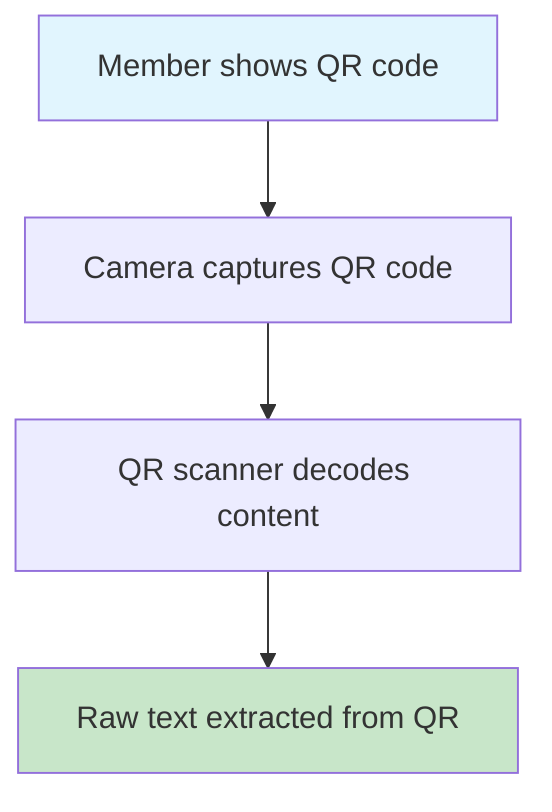
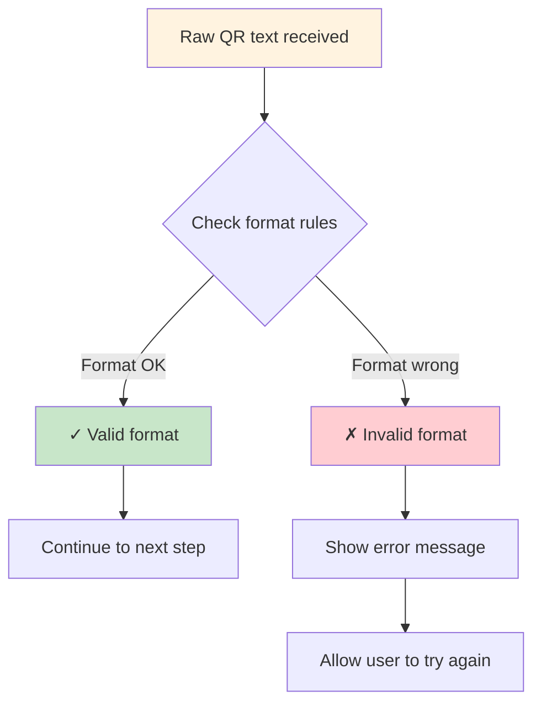
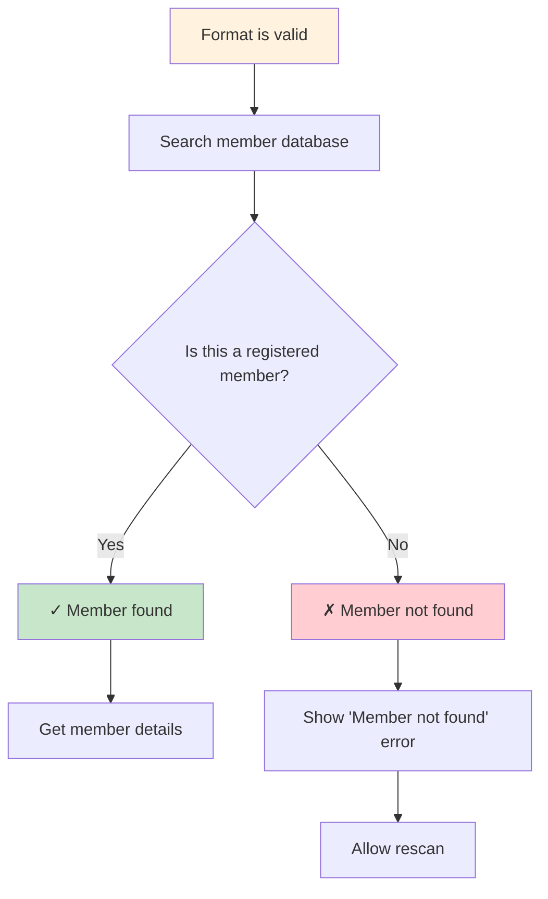
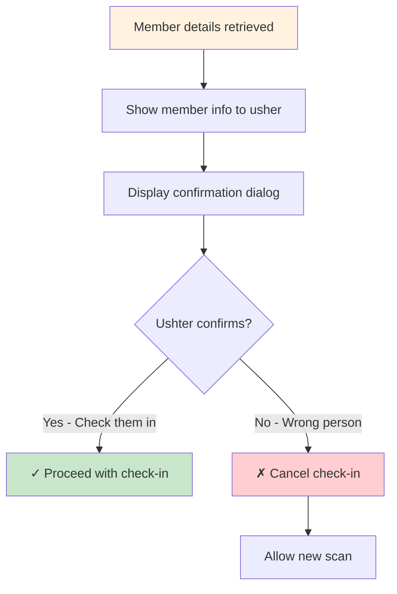
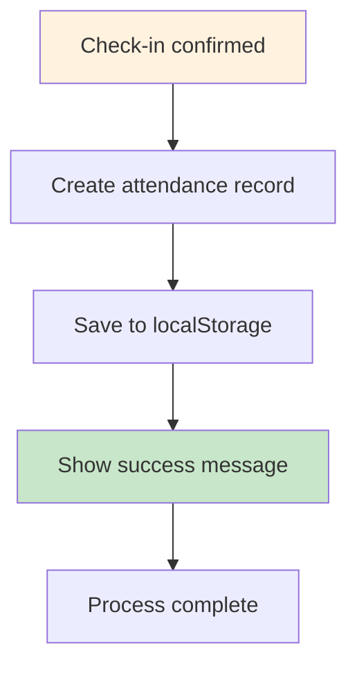
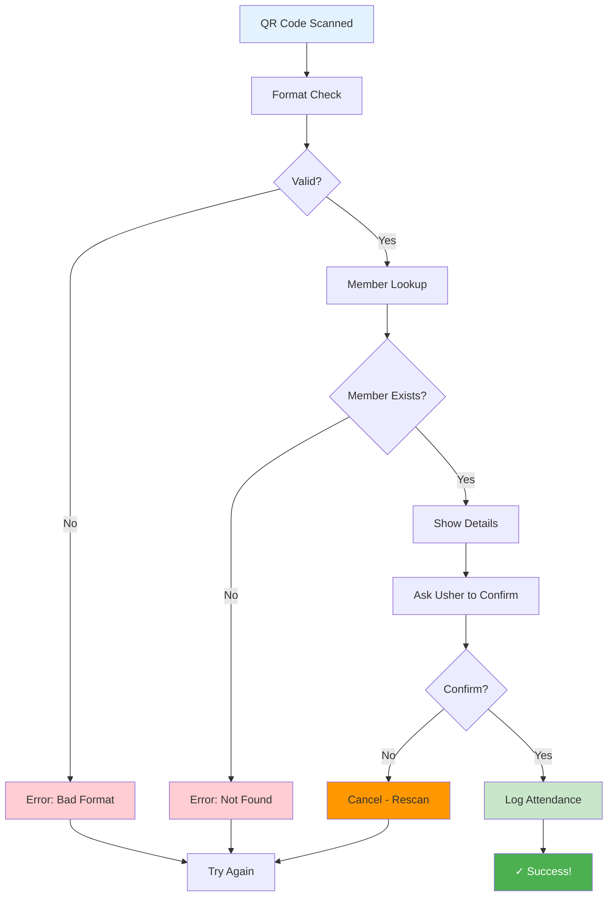

# QR Code Confirmation Process - Proposed Implementation

This document outlines a proposed QR code scanning and confirmation process for the BOL-TAS system that adds proper validation and user confirmation before logging attendance.

## Current System Issues

The current QR scanning implementation has no validation:
- Accepts any QR code content without checking
- No member verification
- No user confirmation step
- Only allows undo after logging

## Proposed Validation Process

### Step 1: Initial QR Code Detection



**What happens:** The camera reads the QR code and extracts whatever text is encoded in it.

### Step 2: Format Validation



**What happens:** The system checks if the QR content follows expected rules (like length, characters, or structure).

### Step 3: Member Lookup



**What happens:** The system looks up the member using the QR code data to make sure they exist in the system.

### Step 4: User Confirmation



**What happens:** The usher sees who the system thinks is checking in and can confirm or cancel.

### Step 5: Final Processing



**What happens:** Only after all validations pass and user confirms, the attendance is recorded.

## Complete Flow Overview



## Implementation Benefits

### Current System Problems:
- ❌ Accepts any QR code (even invalid ones)
- ❌ No way to verify the person
- ❌ No confirmation step
- ❌ Only undo after logging

### Proposed System Benefits:
- ✅ Validates QR code format first
- ✅ Confirms member exists
- ✅ Shows details before logging
- ✅ Requires usher confirmation
- ✅ Prevents errors before they happen

## Technical Implementation Notes

### Required Components:
1. **QR Format Validator**: Function to check QR content structure
2. **Member Lookup Service**: Database/API call to verify member
3. **Confirmation Dialog**: UI component for usher confirmation
4. **Error Handling**: User-friendly error messages and retry options

### Data Flow:
```
QR Scan → Format Validation → Member Lookup → User Confirmation → Attendance Logging
```

### Error Scenarios:
- Invalid QR format → Show format error, allow retry
- Member not found → Show "member not found" error, allow retry
- User cancels → Return to scan mode
- Network/API errors → Show connection error, allow retry

This validation process ensures data integrity and gives ushers control over the attendance logging process.