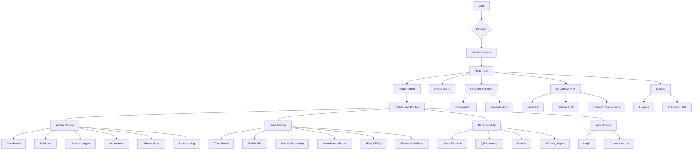
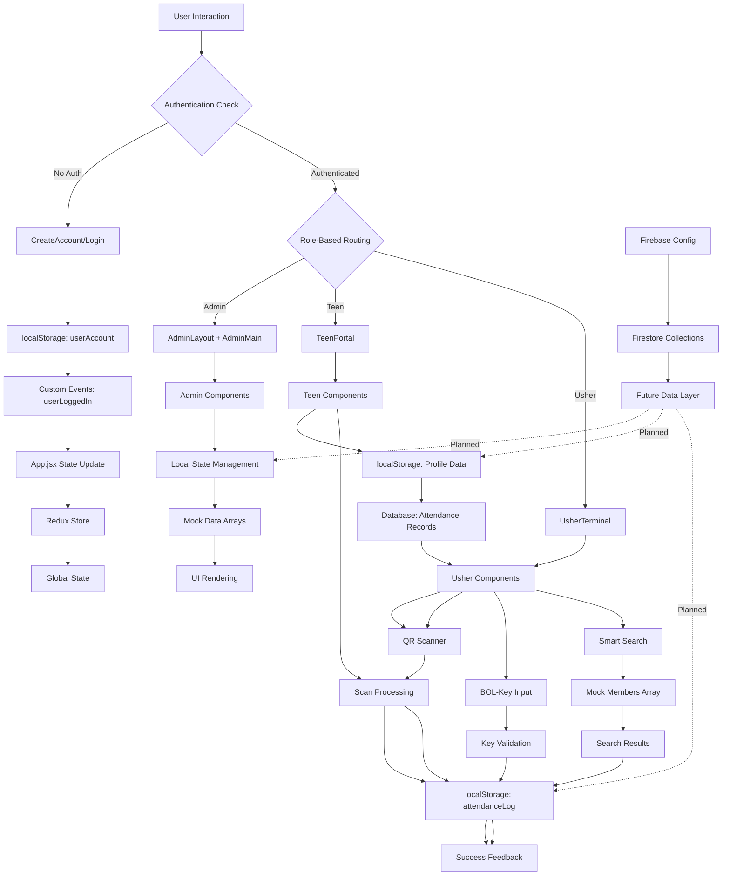
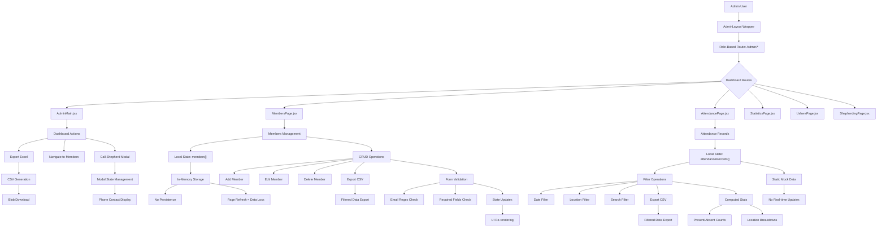

# BOL-TAS (Church Management System)

A modern React-based church management application featuring role-based access control, QR code attendance tracking, and comprehensive administrative tools.

## 🎯 Overview

BOL-TAS is a comprehensive church management system designed to streamline operations for teens, ushers, and administrators. The system provides secure authentication, real-time attendance tracking, member management, and detailed analytics.

## 🏗️ System Architecture

### Core Architecture



### Technology Stack

- **Frontend Framework:** React 18 with modern hooks
- **Build Tool:** Vite with Rolldown
- **State Management:** Redux Toolkit (configured)
- **Styling:** Tailwind CSS + Radix UI primitives
- **Routing:** React Router DOM v6
- **Backend:** Firebase (Firestore + Auth)
- **QR Processing:** html5-qrcode library
- **Charts:** Recharts for data visualization

## 🔄 Data Flow Architecture

### Complete System Data Flow



### Admin-Specific Data Flow



## 👥 User Roles & Features

### 🔐 Authentication System
- **localStorage-based** session management
- **Custom events** for cross-tab synchronization
- **Role-based routing** with strict access control

### 👨‍💼 Admin Role
**Dashboard Features:**
- Real-time attendance statistics
- Member management (CRUD operations)
- Attendance record viewing and filtering
- Usher performance monitoring
- Shepherding contact management
- Data export capabilities (CSV)

**Data Operations:**
- In-memory member management
- Static attendance record viewing
- Client-side data filtering and search
- CSV export of filtered data

### 👦 Teen Role
**Portal Features:**
- Personal profile management with dynamic attendance/volunteer tracking
- Security settings and recovery options
- Comprehensive attendance history with real-time calculations
- ID card display with QR code generation
- Help & FAQ system with searchable guidance
- Church guidelines and code of conduct
- Cross-page navigation between profile and support sections

**Data Operations:**
- localStorage profile persistence with database integration
- Real-time attendance record calculation from database
- Dynamic volunteer role detection (active assignments + profile data)
- Form-based data updates with validation
- Recovery method configuration
- Cross-page state management for seamless navigation

### 👨‍🏫 Usher Role
**Terminal Features:**
- QR code scanning for attendance
- BOL-key manual entry system
- Smart search functionality
- Real-time attendance logging
- Undo operations with time limits

**Data Operations:**
- localStorage attendance log persistence
- Timestamp-based check-in tracking
- Multiple check-in methods (QR, BOL-key, search)
- Attendance undo with 5-second window

## 📊 Data Management

### Current Implementation Status

#### ✅ Fully Implemented
- Role-based UI and routing
- QR code scanning and processing
- BOL-key entry validation
- Smart search with member lookup
- localStorage session management
- CSV export functionality
- Dynamic attendance record calculation
- Real-time volunteer role detection
- Help & FAQ system with cross-page navigation
- Church guidelines and code of conduct
- Database integration for attendance tracking
- Accessibility compliance (WCAG standards)

#### ⚠️ Partially Implemented
- Redux store (configured but unused)
- Firebase services (infrastructure ready)

#### ❌ Not Yet Implemented
- Real database integration
- Server-side data persistence
- Real-time synchronization
- User authentication via Firebase

### Data Flow Patterns

#### State Management Layers
1. **Local Component State** - Form inputs, UI states, immediate feedback
2. **localStorage Persistence** - Sessions, attendance logs, profiles
3. **Redux Store** - Global state infrastructure (ready for expansion)
4. **Firebase Integration** - Backend services (planned)

#### Data Operations
- **Read:** Array filtering, searching, computed statistics, database queries
- **Write:** Array manipulation, localStorage updates, database record creation
- **Calculate:** Dynamic attendance percentages, volunteer role detection
- **Navigate:** Cross-page state management, seamless transitions
- **Export:** CSV generation, blob downloads
- **Validate:** Client-side form checks, regex validation, data integrity

## 🚀 Getting Started

### Prerequisites
- Node.js (version 18 or higher)
- npm or yarn

### Installation

1. **Clone the repository:**
   ```bash
   git clone <repository-url>
   cd bol-tas
   ```

2. **Install dependencies:**
   ```bash
   npm install
   ```

3. **Start development server:**
   ```bash
   npm run dev
   ```

4. **Open in browser:**
   ```
   http://localhost:5173
   ```

### Available Scripts
- `npm run dev` - Start development server
- `npm run build` - Build for production
- `npm run preview` - Preview production build
- `npm run lint` - Run ESLint

## 📁 Project Structure

```
bol-tas/
├── public/
│   └── vite.svg
├── src/
│   ├── components/
│   │   ├── auth/           # Authentication components
│   │   ├── layout/         # Layout wrappers
│   │   └── shared/ui/      # Reusable UI components
│   ├── modules/            # Feature modules by role
│   │   ├── admin/          # Admin dashboard
│   │   ├── teen/           # Teen portal
│   │   └── usher/          # Usher terminal
│   ├── firebase/           # Backend service integration
│   ├── utils/              # Helper functions
│   └── assets/             # Static assets
├── eslint.config.js
├── vite.config.js
├── tailwind.config.js
├── package.json
└── README.md
```

## 🔧 Development Guidelines

### Code Quality
- ESLint with flat configuration
- Prettier for code formatting
- Husky + lint-staged for pre-commit hooks

### State Management
- Redux Toolkit configured for global state
- Local component state for UI concerns
- localStorage for session persistence

### Styling
- Tailwind CSS for utility-first styling
- Radix UI for accessible primitives
- Custom CSS variables for theming

## 🔮 Future Enhancements

### Backend Integration
- Firebase Firestore for data persistence
- Firebase Authentication for user management
- Real-time data synchronization
- Cloud functions for business logic

### Advanced Features
- ✅ Help & FAQ system with searchable guidance
- ✅ Church guidelines and code of conduct
- ✅ Dynamic attendance tracking and reporting
- ✅ Real-time volunteer role management
- ✅ Cross-page navigation and state management
- Real-time attendance notifications
- Advanced analytics and reporting
- Mobile app companion
- Multi-church support
- API integrations

### User Support & Accessibility
- ✅ Comprehensive Help & FAQ system
- ✅ Church guidelines and code of conduct
- ✅ Cross-page navigation assistance
- ✅ WCAG accessibility compliance
- ✅ Screen reader support
- ✅ Keyboard navigation
- ✅ Focus management

### Performance Optimizations
- Code splitting by role
- Service worker for offline support
- Database indexing and caching
- Progressive Web App features

## 📝 License

This project is private and not licensed for public use.

## 🤝 Contributing

1. Fork the repository
2. Create a feature branch: `git checkout -b feature/your-feature`
3. Commit changes: `git commit -m 'Add some feature'`
4. Push to branch: `git push origin feature/your-feature`
5. Open a pull request

---

**Built with ❤️ for church community management**
