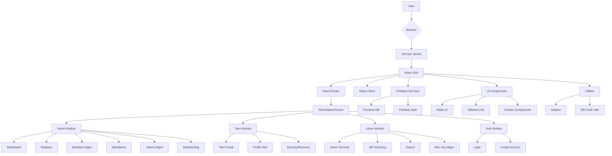
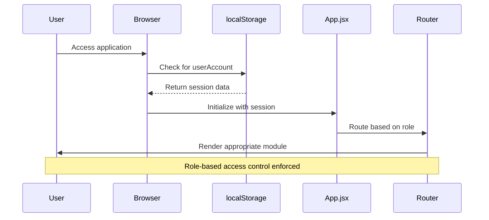
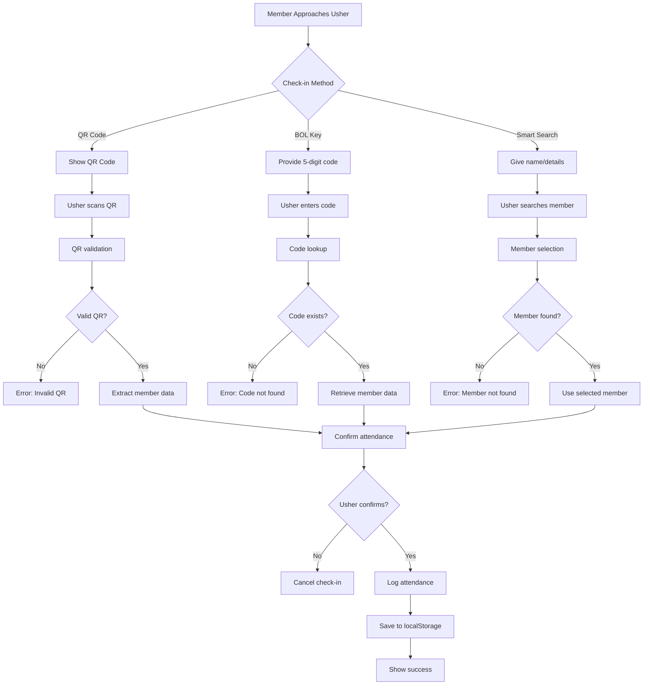

# BOL-TAS System Architecture

## System Overview

BOL-TAS is a church management application built as a modern React single-page application with role-based access control. It serves three main user types: administrators, teens, and ushers, providing secure attendance tracking, member management, and administrative tools.

## High-Level Architecture



## Data Flow Architecture

### Authentication & Session Flow



### Attendance Processing Flow



## Key Architectural Components

### **Frontend Framework**
- **React 18** with modern hooks and concurrent features
- **Vite** for fast development and building
- **React Router DOM** for client-side routing

### **State Management**
- **Redux Toolkit** for global state management
- Local storage for user session persistence
- Custom events for cross-tab synchronization

### **Backend Services**
- **Firebase Firestore** for data storage
- **Firebase Authentication** for user management
- Environment-based configuration

### **UI/UX Layer**
- **Tailwind CSS** for utility-first styling
- **Radix UI** primitives for accessible components
- **Lucide React** for icons
- **Recharts** for data visualization

### **Role-Based Architecture**
The application implements strict role-based routing:

- **Admin Role**: Full administrative dashboard with comprehensive management features
- **Teen Role**: Limited portal for profile management and security settings  
- **Usher Role**: Specialized terminal for church ushering operations (QR scanning, attendance tracking)

### **Modular Structure**
```
src/
├── components/          # Shared UI components
│   ├── auth/           # Authentication components
│   ├── layout/         # Layout components
│   └── shared/ui/      # Reusable UI primitives
├── modules/            # Feature modules by role
│   ├── admin/          # Admin-specific features
│   ├── teen/           # Teen portal features
│   └── usher/          # Usher terminal features
├── firebase/           # Backend service integration
├── utils/              # Helper functions
└── assets/             # Static assets
```

### **Key Features**
- QR code generation and scanning for attendance
- Real-time data synchronization via Firebase
- Responsive design with mobile-first approach
- Progressive Web App capabilities
- Secure authentication with role-based access

This architecture provides a scalable, maintainable foundation for church management operations with clear separation of concerns and role-based functionality.