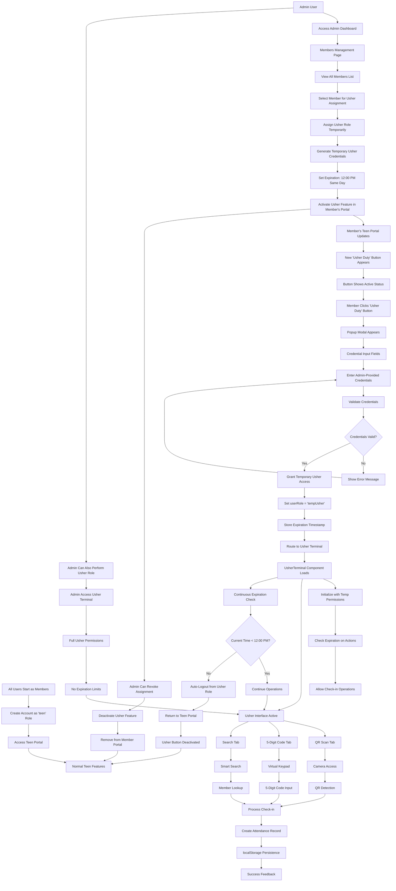

# Admin Usher Terminal Workflow

## Overview

This document describes the Admin Usher Terminal functionality in the BOL-TAS church management system. The Admin Usher Terminal provides administrators with direct access to attendance check-in operations, including QR code scanning, manual entry, and member search capabilities.

## Core Concept

- **Admin Direct Access** - Administrators can access the usher terminal anytime without restrictions
- **Multiple Check-in Methods** - QR scanning, BOL-key entry, and smart search
- **Global Search Integration** - Uses the TopNav search engine for member lookup
- **Dedicated Results Page** - Search results displayed in a separate table view
- **Real-time Status** - Check-in status indicators for each member
- **Mock Data Integration** - Connected to mock database for testing

## Complete Workflow Architecture



## Step-by-Step Process Flow

### Phase 1: Member Registration & Normal Access

1. **Account Creation**
   - User creates account with role 'teen'
   - Receives standard member access
   - Can use teen portal features (profile, security, etc.)

2. **Normal Member Activities**
   - Access to personal dashboard
   - BOL-key management (if applicable)
   - Profile editing and security settings

### Phase 2: Admin Assignment Process

1. **Admin Selection**
   - Admin navigates to Members Management
   - Views complete member list
   - Selects member(s) for usher assignment

2. **Assignment Execution**
   - Admin assigns temporary usher role
   - System generates unique temporary credentials
   - Sets automatic expiration for 12:00 PM same day
   - Activates "Usher Duty" feature in member's portal

3. **Credential Distribution**
   - Admin communicates temporary credentials to selected member
   - Credentials include username/password or access code
   - Member receives notification of assignment

### Phase 3: Member Role Activation

1. **Portal Update**
   - Member's teen portal shows "Usher Duty" button
   - Button indicates active assignment status
   - Visual cue for available usher functionality

2. **Credential Validation**
   - Member clicks "Usher Duty" button
   - Popup modal requests temporary credentials
   - System validates credentials against assignment

3. **Role Transition**
   - Upon successful validation: `userRole` changes to 'tempUsher'
   - Expiration timestamp stored in session
   - Automatic routing to Usher Terminal

### Phase 4: Usher Operations

1. **Terminal Access**
   - Full usher interface becomes available
   - All check-in methods functional (QR, BOL-key, search)
   - Background expiration monitoring active

2. **Check-in Operations**
    - QR code scanning for attendance
    - 5-digit code manual entry
    - Smart search for member lookup
    - All activities logged with member identification

3. **Expiration Management**
   - Continuous time checking in background
   - Automatic logout at 12:00 PM
   - Return to normal teen portal access

### Phase 5: Admin Usher Access

1. **Direct Access**
   - Admin can access Usher Terminal anytime
   - No credential requirements
   - Full usher permissions without time limits

2. **Management Capabilities**
   - Can revoke member assignments
   - Monitor usher activities
   - Access all usher functionality

## Technical Implementation Requirements

### State Management Changes

```javascript
// New role type
const USER_ROLES = {
  teen: 'teen',
  admin: 'admin',
  tempUsher: 'tempUsher'  // New temporary role
};

// Extended user session data
const userSession = {
  role: 'tempUsher',
  expirationTimestamp: 1703971200000,  // 12:00 PM timestamp
  assignedBy: 'admin@example.com',
  assignmentId: 'USH-ASSIGN-001'
};
```

### Portal Feature Activation

```javascript
// Teen portal component logic
const TeenPortal = () => {
  const [hasUsherAssignment, setHasUsherAssignment] = useState(false);
  const [usherCredentials, setUsherCredentials] = useState(null);

  // Check for active usher assignment
  useEffect(() => {
    const checkUsherAssignment = () => {
      // Poll for assignment status
      // Update hasUsherAssignment state
    };
    checkUsherAssignment();
  }, []);

  return (
    <div>
      {/* Normal teen features */}
      {hasUsherAssignment && (
        <UsherDutyButton onClick={handleUsherActivation} />
      )}
    </div>
  );
};
```

### Credential Validation System

```javascript
// Usher activation modal
const UsherActivationModal = ({ onSuccess, onCancel }) => {
  const [credentials, setCredentials] = useState({
    username: '',
    password: ''
  });

  const handleValidation = async () => {
    try {
      // Validate against admin-generated credentials
      const response = await validateTempCredentials(credentials);

      if (response.valid) {
        // Set temporary usher role
        setUserRole('tempUsher');
        setExpirationTimestamp(response.expiration);
        onSuccess();
      } else {
        showError('Invalid credentials');
      }
    } catch (error) {
      showError('Validation failed');
    }
  };

  return (
    <Modal>
      <h3>Enter Usher Credentials</h3>
      <input
        type="text"
        placeholder="Username"
        value={credentials.username}
        onChange={(e) => setCredentials({...credentials, username: e.target.value})}
      />
      <input
        type="password"
        placeholder="Password"
        value={credentials.password}
        onChange={(e) => setCredentials({...credentials, password: e.target.value})}
      />
      <button onClick={handleValidation}>Activate Usher Duty</button>
    </Modal>
  );
};
```

### Expiration Monitoring

```javascript
// Background expiration checker
const useUsherExpiration = () => {
  const [isExpired, setIsExpired] = useState(false);

  useEffect(() => {
    const checkExpiration = () => {
      const now = Date.now();
      const expiration = getUsherExpirationTimestamp();

      if (now >= expiration) {
        // Auto-logout from usher role
        logoutFromUsherDuty();
        setIsExpired(true);
      }
    };

    // Check every minute
    const interval = setInterval(checkExpiration, 60000);
    return () => clearInterval(interval);
  }, []);

  return isExpired;
};
```

## Security Considerations

### Credential Security
- **Temporary Nature**: Credentials auto-expire, preventing reuse
- **Single Use**: Each credential set usable only once
- **Time-Bound**: Strict 12:00 PM expiration
- **Admin Control**: Admin can revoke anytime

### Access Control
- **Role Validation**: Continuous role checking during operations
- **Expiration Enforcement**: Automatic logout prevents unauthorized extension
- **Audit Logging**: All usher activities tracked with member ID

### Data Protection
- **Session Isolation**: Temporary role doesn't affect permanent member data
- **Clean Logout**: Complete role reversion on expiration
- **No Persistent Changes**: Member account remains unchanged

## Admin Management Features

### Assignment Interface
- **Member Selection**: Easy selection from member list
- **Bulk Assignment**: Assign multiple members simultaneously
- **Credential Generation**: Automatic secure credential creation
- **Expiration Setting**: Configurable expiration times

### Monitoring & Control
- **Active Assignments**: View all current usher assignments
- **Real-time Status**: See which members are actively serving
- **Revocation**: Immediate assignment cancellation
- **Activity Reports**: Usher performance and activity logs

## Benefits of This Approach

### Security Benefits
- **No Permanent Role Changes**: Members return to normal access automatically
- **Controlled Access**: Admin approval required for usher duties
- **Time-Limited**: Prevents unauthorized extended access
- **Audit Trail**: Complete tracking of who performed usher duties when

### Operational Benefits
- **Flexible Staffing**: Assign ushers as needed for each service
- **No Account Proliferation**: Single account per person
- **Easy Management**: Simple assignment/revocation process
- **Cost Effective**: No additional account management overhead

### User Experience Benefits
- **Seamless Transition**: Members can switch between roles easily
- **Clear Expectations**: Visual indicators of active assignments
- **Automatic Cleanup**: No manual logout required
- **Familiar Interface**: Uses existing teen portal framework

## Implementation Priority

### Phase 1: Core Infrastructure
- [ ] Extend role system to support 'tempUsher'
- [ ] Add expiration timestamp tracking
- [ ] Create credential generation system

### Phase 2: Admin Features
- [ ] Update Members Management for usher assignment
- [ ] Add assignment UI components
- [ ] Implement credential distribution

### Phase 3: Member Experience
- [ ] Add "Usher Duty" button to teen portal
- [ ] Create credential validation modal
- [ ] Implement role transition logic

### Phase 4: Usher Terminal
- [ ] Add expiration checking to terminal
- [ ] Implement auto-logout functionality
- [ ] Add admin direct access

### Phase 5: Monitoring & Security
- [ ] Add assignment tracking and auditing
- [ ] Implement revocation capabilities
- [ ] Add security logging

This workflow provides a secure, efficient, and user-friendly system for temporary usher assignments while maintaining the integrity of the member management system.