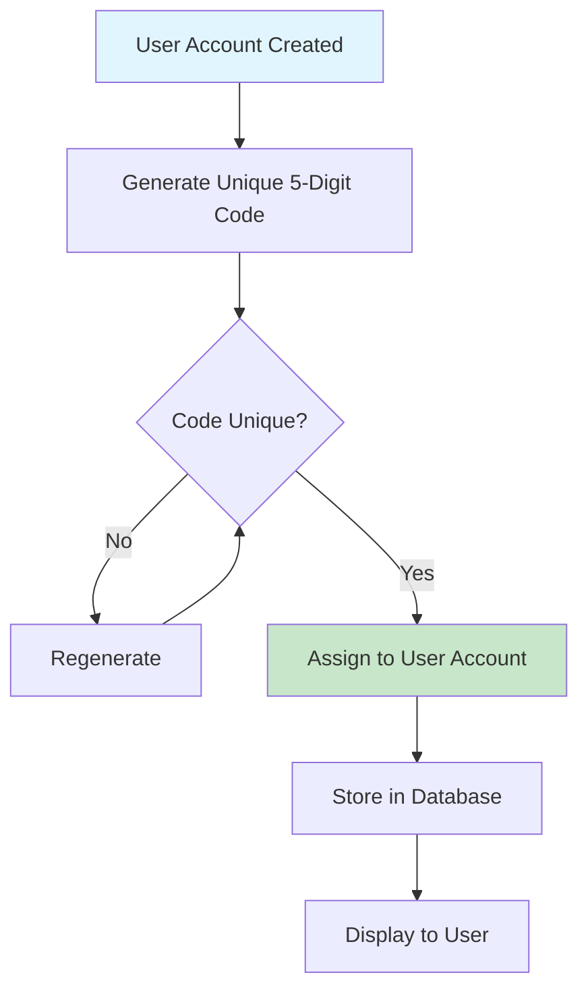
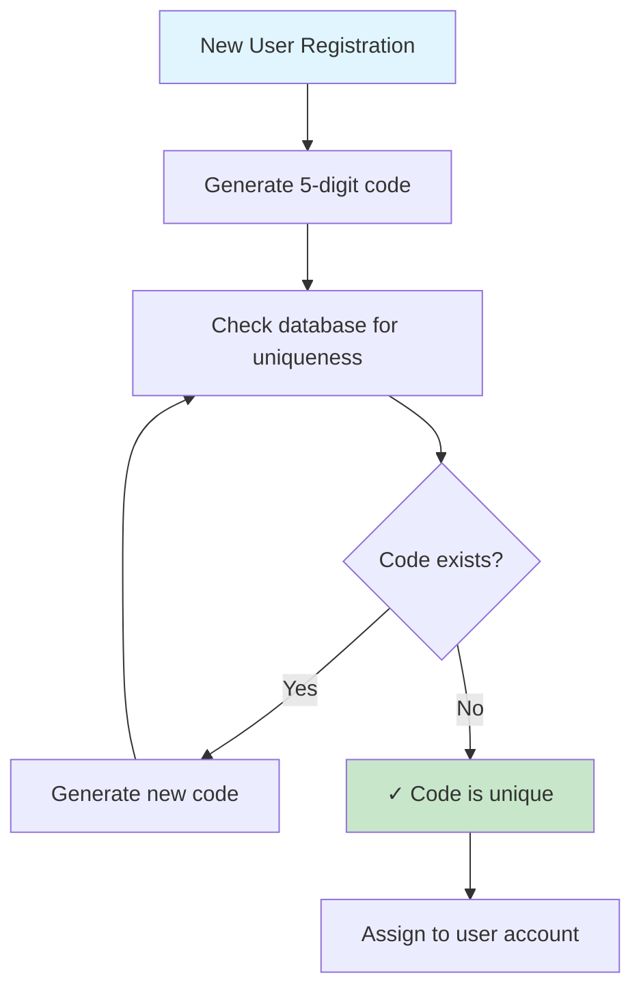
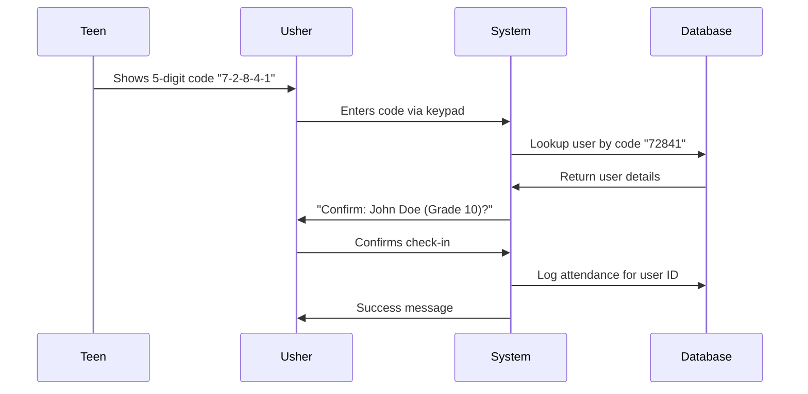
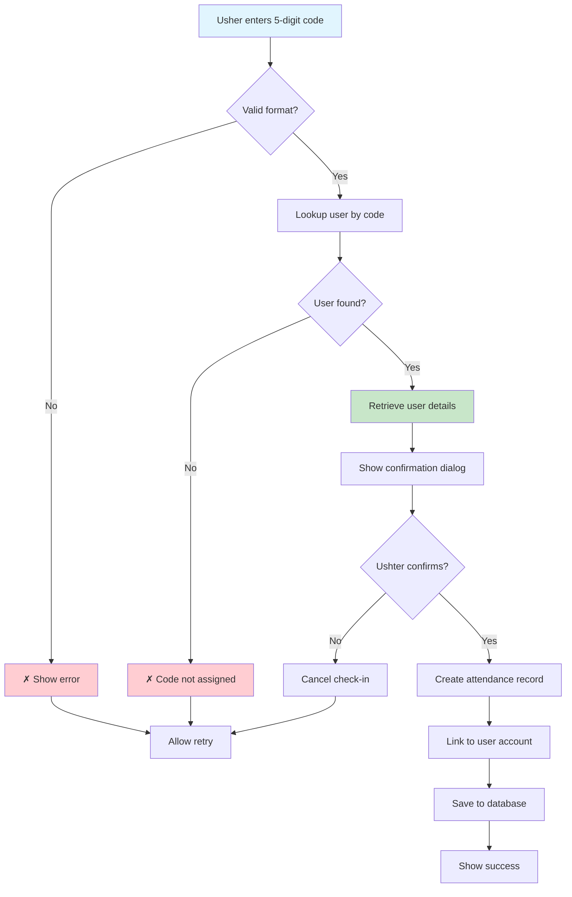

# Unique 5-Digit Code System for BOL-TAS

This document outlines a proposed unique 5-digit code system where each user account is assigned a personal, unique code for attendance check-ins.

## Overview

Instead of the current BOL-Key system ("YY-NNN" format), each user gets a unique 5-digit code (00001-99999) that is permanently tied to their account. This provides better security, accountability, and user experience.

## Code Assignment Process



### Code Generation & Uniqueness Check



## Attendance Check-in Process



## Data Model Changes

### Updated UserAccount Entity
```javascript
{
  id: number,
  name: string,
  email: string,
  password: string,
  role: string,
  createdAt: string,
  personalCode: string,  // New: Unique 5-digit code "72841"
  bolKey?: string,       // Keep for backward compatibility
  // ... other fields
}
```

### Code Generation Logic
```javascript
const generateUniqueCode = async () => {
  let code;
  let isUnique = false;

  while (!isUnique) {
    // Generate 5-digit code (00001 to 99999)
    code = Math.floor(10000 + Math.random() * 90000).toString();

    // Check if code exists in database
    const existingUser = await findUserByCode(code);
    isUnique = !existingUser;
  }

  return code;
};
```

## Complete Check-in Flow



## Security & Benefits

### Security Features
- **Unique per user**: No code collisions or duplicates
- **Account tied**: Each code links directly to a specific user
- **Verification required**: Usher must confirm identity before check-in
- **Audit trail**: All check-ins linked to specific user accounts

### Benefits
1. **Personal**: Each teen has their own unique code
2. **Secure**: Prevents check-ins with wrong or fake codes
3. **Trackable**: Easy to audit attendance and identify issues
4. **Simple**: Just 5 digits, easy to remember and share
5. **Flexible**: Codes can be regenerated if compromised

## User Experience

### For Teens
- Receive unique 5-digit code upon account creation
- Code displayed in their profile/dashboard
- Can share code verbally or show on device
- Can request code change through admin if needed

### For Ushers
- Enter 5-digit code using virtual keypad
- System shows teen's name and basic info for confirmation
- Must confirm identity before logging attendance
- Prevents accidental wrong check-ins

## Comparison with Current BOL-Key System

| Feature | Current BOL-Key | Unique 5-Digit Code |
|---------|----------------|-------------------|
| **Format** | "24-001" (YY-NNN) | "72841" (NNNNN) |
| **Assignment** | General/shared | Personal/unique |
| **Validation** | Format check only | User lookup + confirmation |
| **Security** | Basic | High (user verification) |
| **Tracking** | Limited | Full audit trail |
| **User Experience** | Generic | Personal |

## Implementation Requirements

### Database Changes
- Add `personalCode` field to user accounts table
- Create unique index on `personalCode`
- Migration script to assign codes to existing users

### API Endpoints
- `POST /users/generate-code` - Generate unique code
- `GET /users/by-code/:code` - Lookup user by code
- `PUT /users/:id/regenerate-code` - Change user's code

### UI Components
- Update BOL-Key tab to show "5-Digit Code" instead
- Modify keypad for 5-digit input (no dash)
- Add confirmation dialog with user details
- Update user profile to display personal code

### Validation Logic
```javascript
// Input validation
const isValidCode = (input) => /^\d{5}$/.test(input);

// User lookup
const findUserByCode = async (code) => {
  return await User.findOne({ personalCode: code });
};

// Check-in process
const processCheckIn = async (code) => {
  if (!isValidCode(code)) {
    throw new Error('Invalid code format');
  }

  const user = await findUserByCode(code);
  if (!user) {
    throw new Error('Code not found');
  }

  // Return user details for confirmation
  return {
    id: user.id,
    name: user.name,
    // ... other display fields
  };
};
```

## Migration Strategy

1. **Phase 1**: Add `personalCode` field to database
2. **Phase 2**: Generate unique codes for existing users
3. **Phase 3**: Update UI components
4. **Phase 4**: Train ushers on new system
5. **Phase 5**: Deprecate old BOL-Key system

## Error Handling

- **Invalid Format**: "Please enter exactly 5 digits"
- **Code Not Found**: "This code is not assigned to any member"
- **Duplicate Check-in**: "This member has already checked in today"
- **System Error**: "Unable to process check-in, please try again"

This unique 5-digit code system provides a more secure, personal, and trackable attendance solution compared to the current BOL-Key approach.