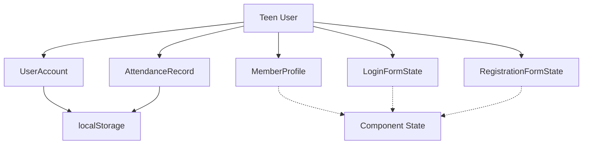
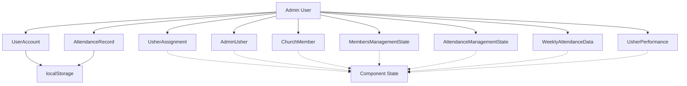
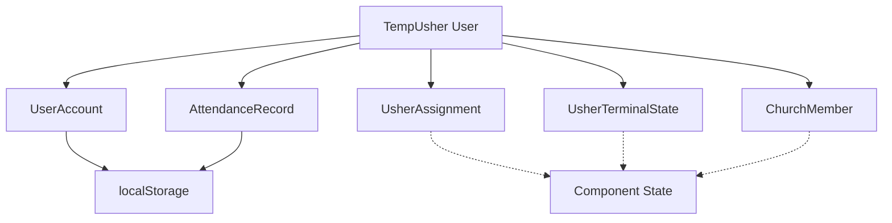
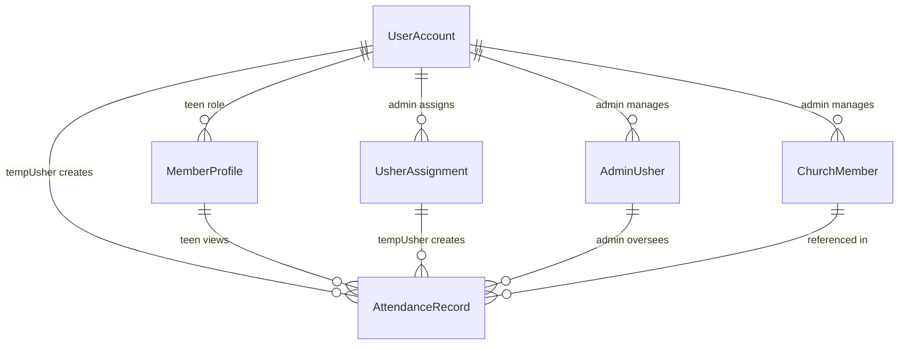

# BOL-TAS User Roles and Associated Entities

This document outlines the three main user roles in the BOL-TAS church management system and the data entities each role interacts with. Each role has specific access patterns and responsibilities within the system.

## System Roles Overview

The BOL-TAS system supports three primary user roles:
- **Teen**: Regular members who manage their profiles and view attendance
- **Admin**: System administrators with full access to manage users, assignments, and data
- **TempUsher**: Temporary ushers assigned for specific sessions to handle attendance check-ins

## 1. Teen Role
Teens primarily manage their own profiles and view attendance records.

**Associated Entities:**
- **UserAccount**: Authentication and basic account info
- **MemberProfile**: Personal information, contact details, ministry involvement
- **AttendanceRecord**: View their own attendance history
- **Form States**: Login and registration forms for account management

## 2. Admin Role
Admins have full system access and manage all aspects of the system.

**Associated Entities:**
- **UserAccount**: Admin authentication
- **UsherAssignment**: Create temporary usher assignments
- **AdminUsher**: Manage permanent usher accounts
- **ChurchMember**: Full member database management
- **AttendanceRecord**: View and manage all attendance data
- **Management States**: UI states for member and attendance administration
- **Analytics Entities**: Attendance trends, usher performance metrics

## 3. TempUsher Role
Temporary ushers are assigned by admins for specific sessions and handle attendance check-ins.

**Associated Entities:**
- **UserAccount**: Temporary authentication with expiration
- **UsherAssignment**: Assignment details and credentials
- **AttendanceRecord**: Create and manage check-in records
- **UsherTerminalState**: Terminal interface state management
- **ChurchMember**: Search and reference member data for check-ins

## Role-Based Access Summary

## Role Permissions Summary

This structure ensures clean separation of concerns where:
- **Teens** focus on personal profile and attendance viewing
- **Admins** have comprehensive system management capabilities
- **TempUshers** have limited, time-bound access for attendance processing

## Data Storage Patterns by Role

- **Persistent (localStorage)**: UserAccount, AttendanceRecord (all roles)
- **Component State**: Role-specific UI states and temporary data
- **Mock Data**: Static reference data (ChurchMember for search operations)

## Security Considerations

- **Teen Role**: Read-only access to own data, no system administration
- **Admin Role**: Full CRUD operations across all entities
- **TempUsher Role**: Time-limited access with automatic expiration at 12:00 PM